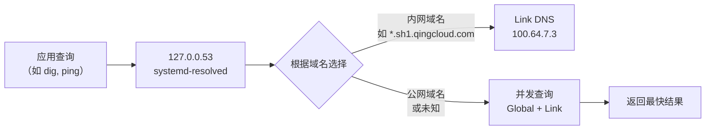

# systemd-resolved 云环境 DNS 配置：从冲突到协作的完全指南

在云主机（如青云 Ubuntu 22.04）上，你经常需要同时访问公网服务和内网资源。但手动修改 `/etc/resolv.conf` 会被重置，而 DHCP 自动下发的 DNS 有时又会与手动指定的公共 DNS 发生优先级混乱。如何让 **公共 DNS（如 223.5.5.5）与内网 DNS（如 100.64.7.3）协同工作**，并避免配置被覆盖？

**systemd-resolved** 是 Linux 系统的本地 DNS 解析服务，它能够合并来自不同来源（手动配置、DHCP、网络管理器）的 DNS 服务器，并按域名智能分流。它解决了传统 `/etc/resolv.conf` 单文件管理的痛点。

systemd-resolved 的核心优势：
- **多源合并**：自动合并 Global DNS（手动设定）和 Link DNS（DHCP 下发），无需重复配置。
- **按域分流**：可根据域名后缀（如 `sh1.qingcloud.com`）选择专用 DNS 服务器。
- **本地缓存**：减少重复查询，提升解析速度。
- **可恢复性**：网络接口变动后自动更新 DNS 配置，无需人工干预。

本文将从安装、工作原理、配置方法、最佳实践及故障排除等方面，帮助你彻底掌握 systemd-resolved 在云环境中的正确用法。

## 目录

- [1. 引言：什么是 systemd-resolved？](#)
- [2. 安装与状态检查](#)
- [3. 核心概念：Global DNS 与 Link DNS](#)
- [4. 配置方法](#)
  * [4.1 手动指定公共 DNS](#)
  * [4.2 依赖 DHCP 自动获取内网 DNS](#)
  * [4.3 软链接模式：stub-resolv.conf vs. resolv.conf](#)
- [5. 最佳实践](#)
  * [5.1 典型云主机配置](#)
  * [5.2 验证配置](#)
- [6. 故障排除](#)
  * [6.1 resolv.conf 总被重置](#)
  * [6.2 警告“Too many DNS servers”](#)
- [7. 总结](#)
- [8. 参考资料](#)

---

## 1. 引言：什么是 systemd-resolved？

在云主机或 Linux 服务器上，DNS 配置往往面临多个“管家”：云平台 DHCP 下发内网 DNS、管理员手动指定公共 DNS、某些网络管理工具也会写入 `/etc/resolv.conf`。直接修改这个文件很容易被覆盖，而完全禁用 DHCP DNS 又会导致内网服务发现失败。

**systemd-resolved** 是 systemd 组件之一，作为本地 DNS stub resolver（桩解析器）运行。它在 `127.0.0.53` 上监听，接收应用程序的 DNS 查询，并根据预先配置的策略，将查询转发到不同的上游 DNS 服务器。它支持：
- 按网络接口（link）配置独立的 DNS 服务器和搜索域。
- 同时使用手动指定的全局 DNS 和 DHCP 下发的 DNS。
- 为不同域名选择最合适的 DNS（例如 `.internal` 域名走内网 DNS，其他走公网 DNS）。

通过与 systemd-networkd 或 NetworkManager 集成，resolved 能够动态感知网络变化，并自动调整 DNS 配置。

---

## 2. 安装与状态检查

Ubuntu 22.04 默认已安装 systemd-resolved。检查服务状态：

```bash
sudo systemctl status systemd-resolved   # 应显示 active (running)
```

检查软链接模式（关键）：

```bash
ls -l /etc/resolv.conf
# 预期输出: /etc/resolv.conf -> ../run/systemd/resolve/stub-resolv.conf
```

若未运行或软链接异常，执行：

```bash
sudo systemctl enable --now systemd-resolved
sudo ln -sf /run/systemd/resolve/stub-resolv.conf /etc/resolv.conf
```

---

## 3. 核心概念：Global DNS 与 Link DNS

systemd-resolved 将 DNS 服务器分为两个层次：

| 层次 | 来源 | 作用范围 | 示例 |
|------|------|----------|------|
| **Global DNS** | `/etc/systemd/resolved.conf` 中 `DNS=` 配置 | 所有网络接口的默认备选 | `223.5.5.5` |
| **Link DNS** | 每个网络接口通过 DHCP 或静态配置获得 | 仅对该接口生效，优先级通常高于 Global | `100.64.7.3`（DHCP 下发） |

查询流程如下：



> **注意**：Link DNS 通常由 DHCP 自动提供，无需手动写入 `resolved.conf`。系统会同时使用两者，并按照域名搜索域智能路由。

---

## 4. 配置方法

### 4.1 手动指定公共 DNS

编辑 `/etc/systemd/resolved.conf`：

```bash
sudo vim /etc/systemd/resolved.conf
```

找到 `[Resolve]` 段落，设置公共 DNS（例如阿里云 `223.5.5.5`，腾讯云 `119.29.29.29`）：

```ini
[Resolve]
DNS=223.5.5.5 119.29.29.29
# FallbackDNS 保持注释即可
```

> **提示**：不要在此处写入内网 DNS（如 `100.64.7.3`），否则会造成冗余。

### 4.2 依赖 DHCP 自动获取内网 DNS

**无需任何配置**。只要云主机的网卡启用了 DHCP（默认启用），systemd-resolved 会自动读取 DHCP 响应的 DNS 服务器和搜索域，作为 Link DNS 应用。

查看当前生效的 Link DNS：

```bash
resolvectl status eth0   # 替换为你的网卡名，如 eth0
```

输出示例：

```
Link 2 (eth0)
      Current Scopes: DNS
       DNS Servers: 100.64.7.3
        DNS Domain: sh1.qingcloud.com
```

### 4.3 软链接模式：stub-resolv.conf vs. resolv.conf

`/etc/resolv.conf` 的链接目标决定了应用查询 DNS 的方式。

| 软链接目标 | 内容特点 | 适用场景 |
|------------|----------|----------|
| `stub-resolv.conf` | 只有 `nameserver 127.0.0.53` | **推荐**。所有查询经过本地 stub resolver，享受缓存、分流等功能 |
| `resolv.conf` | 直接列出上游 DNS（如 `223.5.5.5`、`100.64.7.3`） | 特殊兼容（某些程序不支持 `127.0.0.53`），但会丢失缓存和分流能力 |

> **重要**：`resolv.conf` 直连模式受 glibc 限制，最多只能使用前 3 个 nameserver，且无法按域名分流。**请始终使用 stub 模式**。

切换命令：

```bash
sudo ln -sf /run/systemd/resolve/stub-resolv.conf /etc/resolv.conf
sudo systemctl restart systemd-resolved
```

---

## 5. 最佳实践

### 5.1 典型云主机配置

**目标**：公网域名使用公共 DNS（快速、无污染），内网域名使用 DHCP 下发的内网 DNS（可解析内网短主机名）。

**步骤**：
1. 确认软链接为 stub 模式。
2. 在 `resolved.conf` 中只写公共 DNS，不写内网 DNS。
3. 重启服务。

```bash
# 检查软链接
ls -l /etc/resolv.conf
# 如果指向 stub，跳过；否则执行：
sudo ln -sf /run/systemd/resolve/stub-resolv.conf /etc/resolv.conf

# 配置公共 DNS（仅修改 DNS= 这一行，不影响其他配置）
sudo sed -i 's/^#DNS=.*/DNS=223.5.5.5 119.29.29.29/' /etc/systemd/resolved.conf

# 验证修改结果
grep DNS /etc/systemd/resolved.conf

sudo systemctl restart systemd-resolved
```

### 5.2 验证配置

```bash
# 查看所有生效的 DNS
resolvectl status
```

输出应包含：
- `Global` 部分：`DNS Servers: 223.5.5.5 119.29.29.29`
- `Link N (eth0)` 部分：`DNS Servers: 100.64.7.3` （由 DHCP 提供）

测试解析：

```bash
# 公网域名（应走公共 DNS）
dig @127.0.0.53 cloudflare.com

# 内网短主机名（应自动附加 search 域，走内网 DNS）
ping my-database   # 实际查询 my-database.sh1.qingcloud.com
```

---

## 6. 故障排除

### 6.1 resolv.conf 总被重置

**现象**：手动修改 `/etc/resolv.conf` 后，重启网络或一段时间后恢复原状。

**原因**：`/etc/resolv.conf` 是软链接指向 systemd-resolved 管理的文件，或者被 `cloud-init`、`dhclient` 持续覆盖。

**解决**：确保软链接正确指向 stub 模式，并禁用其他 DNS 管理工具。

```bash
# 修复软链接
sudo ln -sf /run/systemd/resolve/stub-resolv.conf /etc/resolv.conf

# 若 cloud-init 干扰，可覆盖其网络配置（可选）
sudo vim /etc/cloud/cloud.cfg.d/99-disable-dns.cfg
```

写入：
```yaml
manage_resolv_conf: false
```

### 6.2 警告“Too many DNS servers”

**现象**：查看 `/run/systemd/resolve/resolv.conf` 时出现警告，提示“Too many DNS servers configured”。

**原因**：你当前使用的 `/etc/resolv.conf` 指向了 `resolv.conf`（直连模式），而 glibc 的解析器最多支持 3 个 nameserver。当你配置了 3 个以上（含重复）时，会触发警告。

**解决**：切换回 stub 模式即可消除此警告。stub 模式不直接列出上游 IP，因此不受 glibc 限制。

```bash
sudo ln -sf /run/systemd/resolve/stub-resolv.conf /etc/resolv.conf
sudo systemctl restart systemd-resolved
```

---

## 7. 总结

systemd-resolved 是一款灵活的本地 DNS 转发器，通过 Global DNS 和 Link DNS 的自动合并，完美适配云主机这种既需要公共 DNS 又依赖内网 DNS 的场景。其 stub 模式（`127.0.0.53`）提供了本地缓存和按域分流能力，而 DHCP 自动下发的内网 DNS 无需手动干预。

掌握 systemd-resolved 后，你可以：

- 仅配置公共 DNS 到 `resolved.conf`，内网 DNS 完全由 DHCP 管理，零冗余。
- 使用 `resolvectl status` 清晰了解每个链路的 DNS 来源。
- 避免因直接修改 `/etc/resolv.conf` 导致的配置丢失或 glibc 限制警告。
- 在云端和本地开发环境获得一致的 DNS 行为。

建议从验证当前软链接和 `resolvectl status` 开始，逐步迁移到本文推荐的最佳实践。对于多区域或复杂内网场景，可进一步研究 `Domains=` 配置项，实现精确的分流规则。

---

## 8. 参考资料

- [systemd-resolved.service 手册页](https://www.freedesktop.org/software/systemd/man/latest/systemd-resolved.service.html)
- [Ubuntu 官方文档：DNS 配置](https://ubuntu.com/server/docs/network-configuration)
- [man systemd-resolved](https://manpages.ubuntu.com/manpages/jammy/man8/systemd-resolved.8.html)