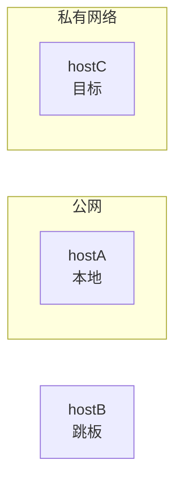

# MD Diagram Skill

用于在 Markdown 笔记中生成高质量流程图和脑图的规则集。
核心目标：**规避工具短板，让图表在 Obsidian 等 MD 渲染环境中效果最佳**。

---

## 第一步：选择工具

不按"简单/复杂"主观判断，而是按以下**结构特征**决策：

### 选 ASCII 的条件（满足全部才用 ASCII）

- [ ] 节点总数 ≤ 6 个
- [ ] 无交叉连线（A→C、B→C 这种汇聚可以，但 A→C 同时 C→B 的回路不行）
- [ ] 无分支嵌套超过 2 层
- [ ] 无需区分多种连线类型（实线/虚线/箭头混用）
- [ ] 纯线性或简单树形，不需要泳道/分组框

> 以上条件有任意一项不满足 → **改用 Mermaid**

### 选 Mermaid 的条件（满足任意一项即用 Mermaid）

- 节点 > 6 个
- 存在回路、循环
- 存在交叉连线或多对多关系
- 需要分组/泳道/子图
- 连线需要区分类型（实线、虚线、粗线）
- 需要展示时序（谁先谁后，多个角色交互）
- 需要展示层级关系 + 附注说明

---

## 第二步：Mermaid 图类型选择

| 场景 | 使用类型 | 示例关键词 |
|------|----------|----------|
| 步骤流转、决策分支、系统架构 | `flowchart` | 流程、步骤、判断、架构 |
| 主题发散、知识结构、概念梳理 | `mindmap` | 脑图、知识点、概念、梳理 |
| 多角色交互、API 调用顺序 | `sequenceDiagram` | 时序、交互、请求响应、谁调用谁 |
| 数据结构、类关系、模块依赖 | `classDiagram` | 类、对象、属性、继承 |
| 项目排期、时间线 | `gantt` | 计划、排期、时间线、里程碑 |
| 数据库表关系 | `erDiagram` | 表、字段、外键、数据库设计 |

---

## 第三步：语法规则（必须遵守）

### Mermaid 必须遵守的规则

#### ✅ 换行用 `<br>`，禁止用 `\n`

```
// ❌ 错误 - Obsidian 会明文显示 \n
A["hostA\n本地机器"]

// ✅ 正确
A["hostA<br>本地机器"]
```

#### ✅ 含特殊字符的标签必须加引号

需要引号的字符：`(` `)` `:` `-` `/` `#` `&`

```
// ❌ 错误
A[hostA (本地)]

// ✅ 正确
A["hostA (本地)"]
```

#### ✅ flowchart 方向选择

| 内容特点 | 推荐方向 |
|---------|---------|
| 步骤流程、pipeline | `LR`（左→右）|
| 层级树形、组织架构 | `TD`（上→下）|
| 步骤较多需要纵向滚动 | `TD` |
| 宽屏展示、横向对比 | `LR` |

#### ✅ 连线类型速查

```
A --> B          实线箭头（默认）
A --- B          实线无箭头
A -.-> B         虚线箭头（表示可选、穿透、逻辑关系）
A ==> B          粗实线箭头（强调主路径）
A -->|标签| B    带标签的连线
```

#### ✅ 子图分组语法



#### ✅ mindmap 注意事项

- `mindmap` 类型不支持 `<br>`，长标签直接换行写或截短
- 缩进必须一致（用空格，不要混用 tab）
- 根节点只能有一个

```
mindmap
  root((核心主题))
    分支一
      子节点A
      子节点B
    分支二
      子节点C
```

---

### ASCII 图规则

#### 风格选择（AI 根据内容自动判断）

**线性流程** → 用方框+箭头风格：
```
[步骤一] → [步骤二] → [步骤三]
              ↓
           [异常处理]
```

**层级/分类** → 用树形缩进风格：
```
根节点
├── 分支一
│   ├── 子节点 A
│   └── 子节点 B
└── 分支二
    └── 子节点 C
```

#### ASCII 规则

- 宽度控制在 **60 字符以内**（超出在 Obsidian 移动端会折行变形）
- 箭头优先用 `→`（单字符），避免用 `-->` 或 `=>`（宽度浪费）
- 树形用 `├──` `└──` `│`（不要用 `-` 或 `*` 替代）
- ASCII 图放在代码块中：` ```text ` 或不加语言标记的 ` ``` `

---

## 第四步：输出质量检查（生成后自检）

在输出任何图表前，过一遍以下清单：

- [ ] 有没有用 `\n`？→ 全部替换为 `<br>`
- [ ] 含特殊字符的节点标签加引号了吗？
- [ ] ASCII 图宽度是否超过 60 字符？
- [ ] Mermaid mindmap 是否误用了 `<br>`？
- [ ] flowchart 方向是否符合内容特点？
- [ ] 连线类型是否准确表达了关系语义（实线/虚线用对了吗）？

---

## 附：工具短板备忘

| 工具 | 短板 | 规避方式 |
|------|------|---------|
| ASCII | 交叉连线无法画、宽度受限、移动端容易折行 | 节点多/有交叉时换 Mermaid |
| Mermaid flowchart | `\n` 不换行、特殊字符报错 | 用 `<br>`，标签加引号 |
| Mermaid mindmap | 不支持 `<br>`、不支持连线样式 | 标签保持简短，接受单行 |
| Mermaid sequenceDiagram | 不支持子图、节点样式有限 | 仅用于时序场景，不强行用 |
